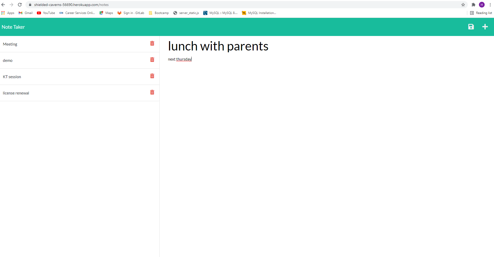

# Week11_Homework 
Note Taker 

## The Task

This assignment was to modify starter code to create an application called Note Taker that can be used to write and save notes. This application uses an Express.js back end and saves and retrieves note data from a JSON file.

Deployed with Heroku. [Note Take app](https://shielded-caverns-56690.herokuapp.com/notes)

## Skills Used

- JavaScript
- Node.js
- Express.js

## Mock-Up

The following images show the web application's appearance and functionality: 

## License

MIT